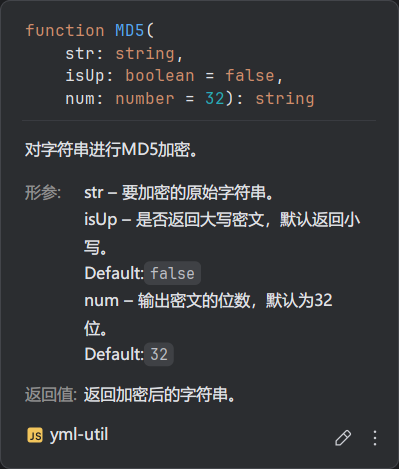

## 介绍
一个js工具库, 根据自己的使用习惯封装了几个函数
,可以自己看下源码

git源码: [github](https://github.com/yml2213/yml-util.git)

## 使用例子
```js
const yml = require("yml-util");
let data = '123456'
console.log(yml.encrypt.MD5(data))
console.log(yml.encrypt.SHA1(data))
console.log(yml.time.ts13())
// 输出
`
e10adc3949ba59abbe56e057f20f883e
7c4a8d09ca3762af61e59520943dc26494f8941b
1730434370381
`

```
## 每个函数都有中文注释
